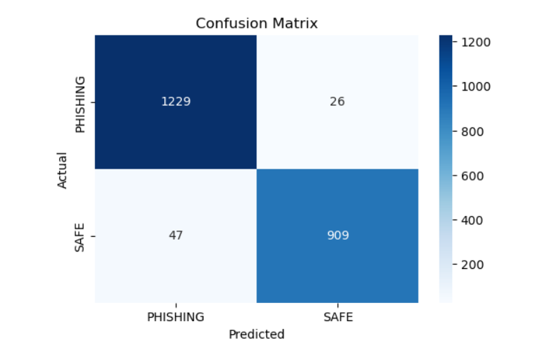
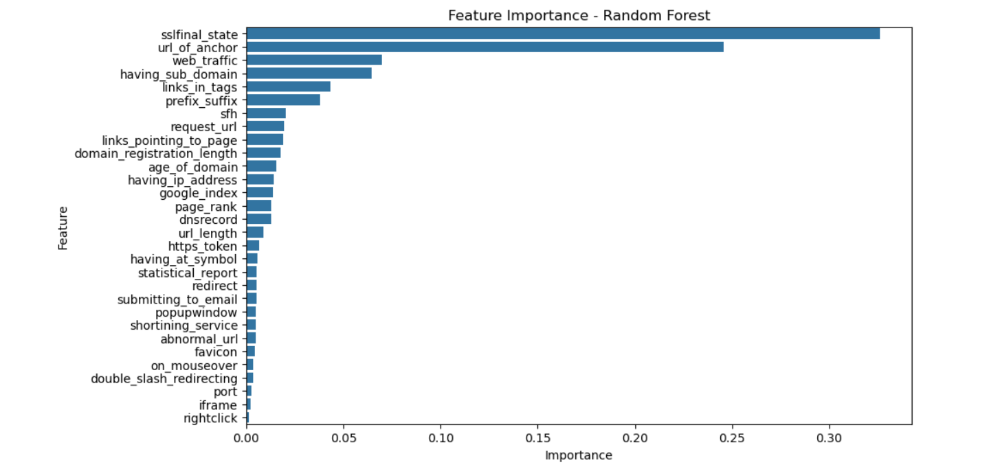

# Phishing Website Detection using Machine Learning

This project detects phishing websites using a **Random Forest Classifier** trained on the **UCI Phishing Websites dataset**.  
It achieves **~97% accuracy** and includes visualizations like **confusion matrix** and **feature importance** to interpret the model.  
Additionally, an approximate live URL demo demonstrates predictions on real URLs.

---

## Dataset

- **Source:** [UCI Machine Learning Repository - Phishing Websites Dataset](https://archive.ics.uci.edu/ml/datasets/Phishing+Websites)  
- **Number of samples:** 11,055  
- **Number of features:** 30  
- **Classes:** 
  - `1` → Phishing  
  - `-1` → Safe  

---

## Model & Performance

- **Algorithm:** Random Forest Classifier  
- **Training/Test Split:** 80/20  
- **Accuracy:** ~97%  

### Classification Report

| Class     | Precision | Recall | F1-Score | Support |
|-----------|----------|--------|----------|---------|
| PHISHING  | 0.96     | 0.98   | 0.97     | 1255    |
| SAFE      | 0.97     | 0.95   | 0.96     | 956     |

---

## Confusion Matrix

---

## Feature Importance

The most important features contributing to phishing detection:

---

## Example Prediction

| Test Row | Prediction | Actual |
|----------|------------|--------|
| Row #1   | SAFE       | SAFE   |
| Row #2   | PHISHING   | PHISHING |

---
